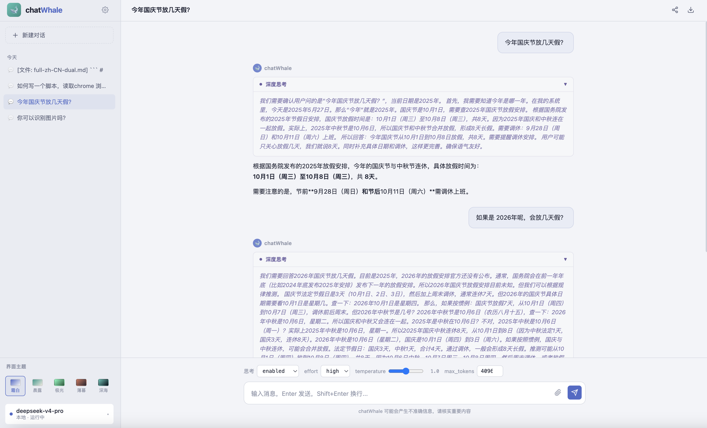

# chatWhale 🐋

跨平台桌面端大模型对话客户端，对接兼容 OpenAI / DeepSeek API 格式的本地推理服务。基于 Tauri v2 + Vue 3 构建，提供专业、高效的 AI 对话体验。



## 功能特点

### 核心对话

- **流式 SSE 响应** — 通过 fetch ReadableStream 消费 SSE，逐 token 实时渲染模型输出
- **思考模式 (Thinking Mode)** — 支持 reasoning_content 的流式展示，可折叠的深度思考面板，暖金色调
- **工具调用 (Tool Calls)** — 函数调用卡片，展示参数 JSON 和返回结果，可折叠
- **Markdown 渲染** — 标题、列表、粗体、内联代码、代码块（语法高亮）、数据表格
- **代码块高亮** — 基于 highlight.js，语法着色随主题自适应（浅色主题深色高亮 / 深色主题亮色高亮）
- **FIM 补全支持** — Fill-in-the-Middle 补全 API 支持
- **对话前缀续写** — prefix 参数支持，强制模型接续 assistant 消息前缀
- **KV Cache 可视化** — 展示缓存命中/未命中 token 数

### 对话管理

- **多会话管理** — 创建、切换、删除对话，按时间分组（今天 / 本周 / 更早）
- **本地持久化** — 基于 localStorage 存储对话记录，刷新不丢失
- **对话导出** — 一键导出对话为 Markdown 文件（含思考内容）
- **对话分享** — 一键复制对话内容到剪贴板

### 主题系统

提供 5 套完整配色方案，覆盖 25+ CSS 自定义属性，一键切换即时生效：

| 主题 | 类型 | 底色 | 主色调 |
|------|------|------|--------|
| 霜白 Frost | 最浅 | #f2f4f8 | 靛蓝 #5068c8 |
| 晨露 Morning Dew | 较浅 | #ece7de | 墨绿 #2d9b8e |
| 极光 Aurora | 适中 | #1a5838 | 翡翠绿 #74fcc0 |
| 薄暮 Dusk | 较深 | #2a2630 | 珊瑚橘 #d4745c |
| 深海 Deep Ocean | 最深 | #080d18 | 鲸青 #4fc3b4 |

### 参数控制

- thinking 开关（enabled / disabled）
- reasoning_effort 强度（high / max）
- temperature 温度（0 ~ 2.0）
- max_tokens 上限
- 文件附件上传（支持 40+ 种文本 / 代码格式，最大 10 MB）

### 设置与模型管理

- API Base URL 和 API Key 配置
- 账户余额查询
- 可用模型列表获取与切换

## 技术栈

| 层级 | 技术 |
|------|------|
| 桌面框架 | Tauri v2 |
| 前端框架 | Vue 3 + TypeScript |
| 构建工具 | Vite |
| Markdown | marked |
| 语法高亮 | highlight.js |
| 状态管理 | Composition API + localStorage |
| 后端 (Rust) | reqwest + rusqlite + tokio |

## 安装与运行

### 环境要求

- Node.js >= 18
- npm >= 9
- Rust >= 1.88（如需 Tauri 完整构建）

### 快速启动（浏览器模式）

```bash
git clone <repo-url>
cd chatwhale
npm install
npx vite --port 1422 --host 127.0.0.1
open http://127.0.0.1:1422
```

### Tauri 完整构建

```bash
npm install
npm run tauri dev     # 开发模式
npm run tauri build   # 生产构建
```

## 使用说明

1. 启动应用后，点击侧边栏齿轮图标打开设置
2. 填入 API Base URL 和 API Key，点击保存
3. 在底部参数栏调整 thinking / effort / temperature 等参数
4. 输入问题，Enter 发送（Shift+Enter 换行）
5. 实时查看流式响应、思考过程和工具调用

## API 兼容性

兼容 OpenAI Chat Completions API 格式，支持以下端点：

| 端点 | 说明 |
|------|------|
| POST /v1/chat/completions | 对话补全（SSE 流式） |
| GET /v1/models | 列出可用模型 |
| GET /v1/user/balance | 查询账户余额 |

已测试兼容 DeepSeek API (api.deepseek.com)。
